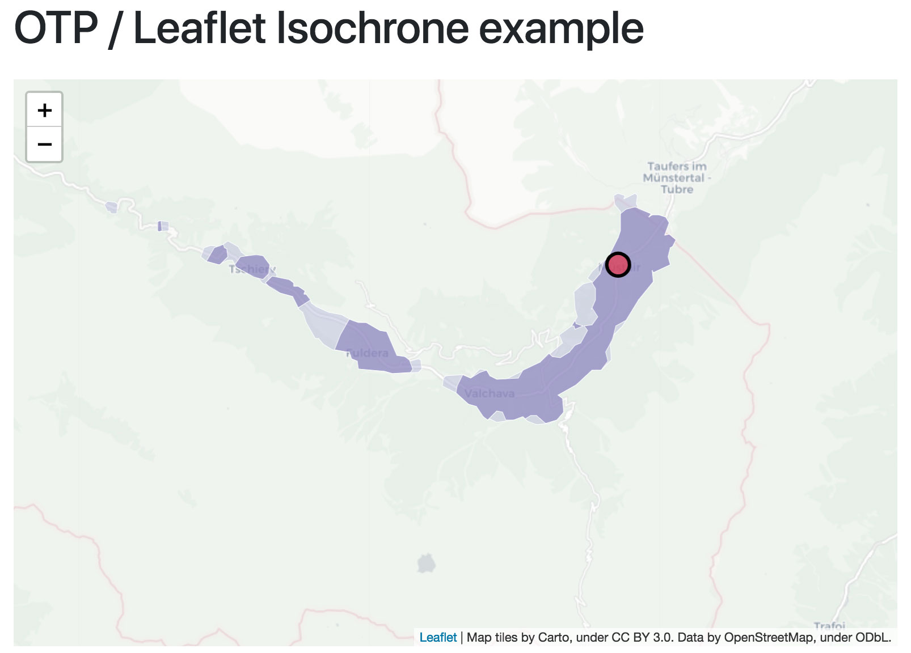

# Calculating travel isochrones with OTP and display the result in Leaflet

This small example shows how to use OpenTripPlanner (OTP) to calculate different travel isochrones and display the result in a simple Leaflet map.

Note: You will need to configure and run your own OTP server.

